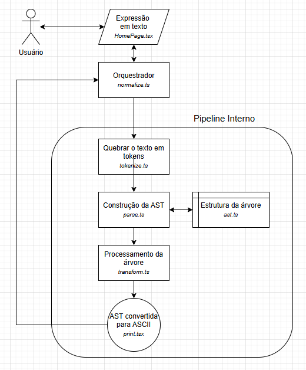

# Lógica do Parser "Backend"

## Ideia geral

A aplicação recebe uma expressão em ASCII, transforma isso em uma árvore sintática (AST), aplica reescritas lógicas controladas e registra cada transformação como um passo didático.

## `ast.ts`

* Arquivo que define como a aplicação enxerga uma fórmula lógica internamente.
* Trabalhamos com algo estruturado, não mais com texto puro. Algo como:
    ```
           IMPL
          /    \
         p      q
    ```
    * Ou seja, uma **árvore sintática** (AST - Abstract Syntax Tree)
* Temos definidos três tipos de nós:
    * `VAR` -> Variável proposicional (`p`, `q1`, `is_valid`)
    * `NOT` -> negação (*~A*)
    * `BIN` -> operador binário (`&`, `|`, `->`, `<->`)
* Os métodos `Var`, `Not` e `Bin` são os que criam os nós
* O método `deepEqual` serve para comparar as árvores. É assim que sabemos se uma transformação mudou a expressão -- e assim podemos registrar um passo.

## `tokenize.ts`

É o arquivo responsável pela análise léxica da expressão. Vai quebrar o texto recebido em pedaços significativos.

* Lê caractere por caractere
* Reconhece operadores de múltiplos caracteres
* Reconhece variáveis
* Ignora espaços
* Retorna uma lista de tokens + `EOF`

### Exemplos

#### Entrada

```
p -> (q & r)
```

#### Saída

```
VAR(p)
IMPL
LPAREN
VAR(q)
AND
VAR(r)
RPAREN
```

## `parse.ts`

É onde construímos a árvore sintática. O parser vai receber os tokens e construir a AST corretamente, respeitando as precedências dos operadores (`~` > `&` > `|` > `->` > `<->`)

### Exemplo

`p & q | r` vira

```
      OR
     /   \
   AND    r
  /   \
 p     q
```

## `print.ts`

É quem faz a "volta" da árvore para o resultado em texto. Também respeita precedências, coloca parênteses onde for necessário e imprime operadores no formato ASCII.

## `transform.ts`

É o coração do sistema, o motor didático que contém as regras lógicas implementadas como reescritas formais. Nessa ordem, faz quatro principais coisas:

1. Elimina `<->`

    ```
    A <-> B  ≡  (A -> B) & (B -> A)
    ```

2. Elimina `->`

    ```
    A -> B  ≡  ~A | B
    ```

3. Convertee para a Forma Normal Negativa
    * Remove dupla negação
    * Aplica De Morgan
    * Empurra negação para as variáveis

4. Distribuição
    * Para **CNF:** distribui `|` sobre `&`
    * Para **DNF:** distribui `&` sobre `|`

Cada transformação realizada compara a AST anterior e nova e, caso haja mudanças, registra um passo com:
* Regra aplicada
* Antes
* Depois
* Explicação

## `normalize.ts`

É o orquestrador de tudo. É a porta de entrada lógica chamada pelo botão *Normalizar*.

## Desenho do Fluxo

